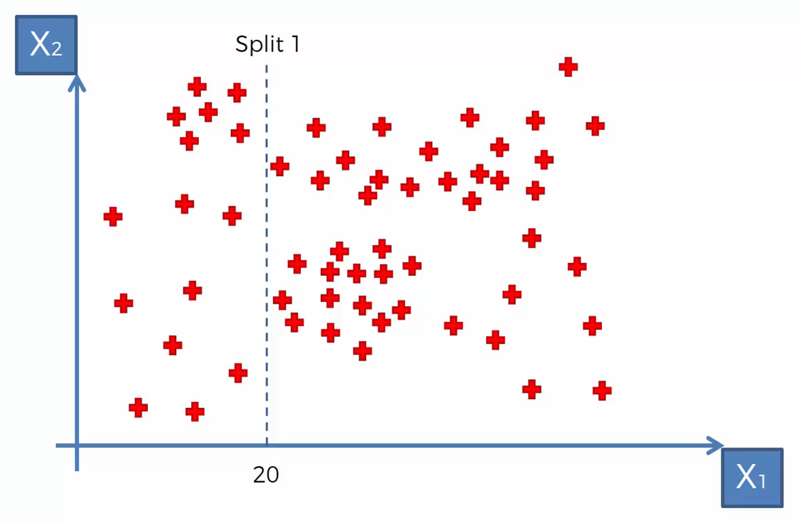

# What is Decision Tree Regression?
Decision Tree Regression is a powerful tool for unraveling the relationships between features and continuous target variables.

## The Core Idea
Imagine a tree with branches and leaves. A decision tree regression model works similarly. It starts with the entire dataset at the root node. Then, at each branch, it asks a question about a specific feature (like "petrol tax" in our case). The answer to the question splits the data into two (or more) subsets, sending data points down appropriate branches.

This process continues until we reach "leaf nodes" where each node holds data points with similar target values (petrol consumption). The average petrol consumption in each leaf node becomes our prediction for new data points that fall into that category.

- Decision tree regression is known for its interpretability. You can easily trace the path a data point takes through the tree and understand the logic behind the prediction.
- It can handle both numerical and categorical features (like "Paved_Highways" in our example).
- It's resistant to outliers in the data.

## Mathematical Magic (Simplified):
While decision tree regression doesn't involve complex formulas, there are key concepts to understand:

- Splitting criteria: At each node, the algorithm chooses the feature and split point that best separates the data based on the target variable. Common metrics include **information gain** or **gini impurity**, which measure how much the split reduces the "impurity" (variation) in the target variable within each branch.
- Leaf nodes: These represent the terminal points of the tree where a final prediction (average petrol consumption) is made based on the data points that reach that node.

## Simplified Example
Decision Tree Regression can be used for 2 variables (2D), 3 variables (3D) and 3+ variables (Multidimentional). We'll cover the 3D one as 2D is simple compared to 3D which is more advanced and it will help understand 2D model on your own. Whereas 3+ variables model will become more advanced and difficult to show visually.

#### Decision Tree Regression Step-by-Step:
Let's consider we have a sample data with X~1~, X~2~ and Y. Following is the plot of X~1~ and X~2~:

1. Let's just focus on `X~1~` and `X~2~` for now. As we learned above, that the model splits the variables via criterian mentioned in the previous section. Let's say the mode did a split on `X~1~` at `20` with decision on the split being `X~1~<20`, as shown in the chart below:
  
   - Based on that let's start filling our decision tree:
  
   - **Note:** This step/node is called the parent node. It is not counted as part of tree depth, a measure of tree size.

1. Now, the model makes another split under the False condition of previous decision/node, but this time it splits on `X~2~` at `170` with decision being `X~2~<170`. Now observe that the split was done on the `False`/`No` end of previous decision, therefore the split on the chart is only on `X~1~>=20` side:
  
   - The current step will get much clearer when you'll look at the following tree progress of split 2:
  

2. Similarly, the next split is again on `X~2~` at 200 (`X~2~<200`) **but** this time it is done on `True`/`Yes` end of the split 1, which means on `X~1~<20` side. Check the chart and tree below for more clarity:
  
   - After the 3rd split, the tree updates accordingly:
  

3. Now, The 4th split is done on `X~1~` at `40` (`X~1~<40`) under `True`/`Yes` side of split 2, which is `X~2~<170` side.
  
   - Now, the last node is filled in our tree:
  

4. Let's come to the `Y` variable that we put aside earlier. Now that all nodes are complete, we come to the leaves of the tree. To predict new `Y` values, the average is calculated of `Y` values in every split of `X~1~` and `X~2~`, and `Y` average of each split is the predicted y value of that split. For simplicity, we'll visualize the Y-axis on the same 2D chart:
  
   - This way the leaves (green boxes) of the tree are completed in our decision tree:
  

5. The previous step marked the completion of our decision tree regression model. Now, one can predict the `Y` values by going through the decision tree starting from the parent node (split 1, `X~1~<20`), but that is just for practice. The prediction part is taken care by the `predict` method of the mode class of `sklearn` library.

**Note:** The decision tree in this example has a depth of 4 levels as you can see in the tree visualization. The parent node is not considered in the depth.

## Understanding our Model:
- Our model, under the hood, will carry out similar steps as you saw in the example above. The decision tree algorithm would analyze the data and potentially ask questions like:
  - Is the petrol tax greater than 8.5? (Split data accordingly)
  - Does the average income exceed 4500? (Further split within a branch)
- Based on these splits and the resulting distribution of petrol consumption within each leaf node, the model would learn to predict petrol consumption for new data points based on their petrol tax and average income.
- Unfortunately, the actual visualization of the decision tree in sklearn is not as pretty as the previous shown charts and visualizations. You'll get something like this:
  
- 

## Key Points to Remember:
- Decision trees can be prone to overfitting if not carefully grown. Techniques like pruning (removing unnecessary branches) or setting a maximum tree depth can help prevent this.
- The choice of splitting criteria and hyperparameters (like minimum data points per leaf node) can influence the tree's structure and performance.

If you want to dig deeper and learn more about Decision Tree Regression, go through the resources given at the end and learn the concepts in depth.

Remember, practice makes one perfect, so grab your data and start exploring!

## Additional Resources

- [Scikit-Learn Documentation - Decision Tree Regression](https://scikit-learn.org/stable/modules/tree.html#regression)  
  - The official documentation of Scikit-Learn provides detailed information about decision tree regression, including its implementation and parameters.

- [Towards Data Science - Understanding Decision Tree Regression](https://towardsdatascience.com/understanding-decision-tree-regression-ad2e9b7a2a5d)  
  - This article on Towards Data Science offers a comprehensive explanation of decision tree regression, covering its concepts, construction, and practical examples.

- [YouTube - Decision Tree Regression Tutorial](https://www.youtube.com/watch?v=g9c66TUylZ4)  
  - This YouTube tutorial provides a step-by-step guide to decision tree regression, explaining the intuition behind the algorithm and demonstrating its implementation.

- [DataCamp - Decision Trees in Python](https://www.datacamp.com/community/tutorials/decision-tree-classification-python)  
  - DataCamp offers a tutorial on decision trees in Python, which covers both classification and regression aspects, providing hands-on coding examples.

- [Medium - Decision Tree Regression Explained](https://medium.com/swlh/decision-tree-regression-explained-214c1ebe5935)
  - This Medium article explains decision tree regression in detail, discussing its advantages, limitations, and practical considerations.

- [UC Business Analytics R Programming Guide - Decision Tree Regression](https://uc-r.github.io/decision_trees)  
  - This guide offers a detailed explanation of decision tree regression using R programming language, including code examples and interpretation of results.

- [ResearchGate - Decision Tree Regression: A Comprehensive Overview](https://www.researchgate.net/publication/328924117_Decision_Tree_Regression_A_Comprehensive_Overview)  
  - This paper provides a comprehensive overview of decision tree regression, discussing its algorithm, applications, and extensions.

- [GitHub - Decision Tree Regression Example](https://github.com/krishnaik06/Decision-Trees)  
  - This GitHub repository contains an example notebook demonstrating decision tree regression using Python's scikit-learn library.

- [Stanford University - CS229: Machine Learning - Decision Trees](https://cs229.stanford.edu/notes2020fall/cs229-notes4.pdf)  
  - The lecture notes from Stanford University's CS229 course provide an in-depth explanation of decision trees, including decision tree regression.

- [Journal of Machine Learning Research - Decision Tree Regression: Principles and Applications](https://www.jmlr.org/papers/volume11/bertsimas10a/bertsimas10a.pdf)  
  - This paper published in the Journal of Machine Learning Research discusses the principles and applications of decision tree regression, including its optimization and practical considerations.

- [Udemy: Machine Learning A-Z](https://www.udemy.com/course/machinelearning/)
  - Credit goes to this great course for the charts used under **Simplified Example** section.
